<div align="center">

# 🧬 DynaMate

### Automated, validation-first GROMACS MD workflow for complex biomolecular systems

**Protein + Cofactor + Metal Ion + Ligand → Parameterization → System Assembly → Solvation → Equilibration → Production MD → Analysis**

<p>
  <a href="https://github.com/Vishu1197/DynaMate">
    
  </a>
  
  
  
  
</p>

<p>
  <b>Prepare once.</b> &nbsp;•&nbsp;
  <b>Validate aggressively.</b> &nbsp;•&nbsp;
  <b>Run reproducibly.</b> &nbsp;•&nbsp;
  <b>Analyze systematically.</b>
</p>

</div>

---

## ⚡ What is DynaMate?

DynaMate is a **modular shell/Python workflow for GROMACS molecular dynamics simulations** of systems containing a protein together with optional cofactors, metal ions, and a ligand.

The project grew out of a practical problem: complex MD systems can fail in places where the resulting topology is still syntactically valid. A simulation may therefore start successfully while containing a subtle setup error.

DynaMate addresses this by turning a long manual workflow into **eight explicit, restartable stages**, with validation and targeted checks built into the pipeline.

> **Core idea:** automate the repetitive mechanics without hiding the scientific decisions that still require the researcher.

---

## 🧪 Supported system model

DynaMate internally normalizes components to generic names so that the workflow stays reusable across projects.

| Component | Internal name | Examples |
|---|---|---|
| 🧬 Protein | `Protein` | Any protein / multi-chain protein |
| ⚛️ Cofactor | `COF` | GDP, GTP, ATP, ADP, NAD, NADP, FAD, FMN, SAM, CoA, HEM, PLP, TPP… |
| 🔩 Metal ion | `MI` | MG, ZN, MN, CA, FE, CU, NI, K, NA… |
| 💊 Ligand | `LIG` | Your docked / studied compound |

The cofactor and metal can be **auto-detected from `REC.pdb`**. If the automatic identification is not appropriate for a particular structure, it can be overridden through `config.sh`.

Systems without a cofactor, metal, or both are also supported; the corresponding stages are skipped.

---

# 🔬 Workflow

The complete pipeline is organized as independent stages so that a failed or modified stage can be rerun without rebuilding everything.

<div align="center">



</div>

### Pipeline at a glance

```text
REC.pdb + LIG.pdb
        │
        ▼
┌─────────────────────┐
│ 1. Prepare          │  Split protein / cofactor / metal
└─────────┬───────────┘
          ▼
┌─────────────────────┐
│ 2. Parameterize     │  AmberTools / GAFF2 / GROMACS
└─────────┬───────────┘
          ▼
┌─────────────────────┐
│ 3. Assemble         │  Coordinates + topology validation
└─────────┬───────────┘
          ▼
┌─────────────────────┐
│ 4. Solvate          │  Water + counter-ions
└─────────┬───────────┘
          ▼
┌─────────────────────┐
│ 5. Minimize         │  Steepest-descent energy minimization
└─────────┬───────────┘
          ▼
┌─────────────────────┐
│ 6. Equilibrate      │  NVT → NPT with restraints
└─────────┬───────────┘
          ▼
┌─────────────────────┐
│ 7. Production MD    │  Unrestrained, restartable MD
└─────────┬───────────┘
          ▼
┌─────────────────────┐
│ 8. Analyze          │  RMSD / RMSF / Rg / SASA / H-bonds / …
└─────────────────────┘
```

---

# 🚀 Quick start

## 1. Clone the repository

```bash
git clone https://github.com/Vishu1197/DynaMate.git
cd DynaMate
```

## 2. Prepare your working directory

DynaMate expects two primary input structures:

```text
REC.pdb
LIG.pdb
```

Place them in your simulation working directory.

## 3. Run the workflow

```bash
/path/to/DynaMate/run_all.sh
```

That's the main interface:

```text
2 structure files
      +
1 command
      ↓
complete MD workflow
```

### Useful execution modes

```bash
# Run the complete workflow
./run_all.sh

# Run setup through equilibration, stopping before production
./run_all.sh --setup

# Resume from a particular stage
./run_all.sh --from 3

# See which stages have already completed
./run_all.sh --list
```

A completed stage leaves a marker and is skipped on subsequent runs. To deliberately rerun a completed stage:

```bash
FORCE=1 ./run_all.sh
```

---

# 📥 Input preparation

## `REC.pdb`

`REC.pdb` should contain:

- 🧬 Protein
- ⚛️ Cofactor, if present
- 🔩 Metal ion, if present
- ❌ No docked ligand
- ❌ No unnecessary crystallization additives / solvent molecules

The workflow detects the cofactor and metal from the receptor structure.

## `LIG.pdb`

`LIG.pdb` should contain:

- 💊 Ligand only
- ➕ Explicit hydrogens
- 🧹 Reasonably clean geometry

For a Chimera-based preparation workflow:

1. Select the ligand.
2. Show only the ligand.
3. Add hydrogens using **Structure Editing → AddH**.
4. Minimize the ligand structure.
5. Save the selected ligand as `LIG.pdb`.

> ⚠️ **Important:** GAFF2 parameterization depends on correct protonation, atom typing, and charge assignment. DynaMate cannot determine the scientifically correct protonation state of your ligand for you.

---

# 🧩 The 8 stages

| # | Script | Purpose |
|---:|---|---|
| **01** | `01_prepare.sh` | Split `REC.pdb` into `Protein.pdb`, `COF.pdb`, and `MI.pdb`; build the protein topology with `pdb2gmx`. |
| **02** | `02_parameterize.sh` | Parameterize cofactors and ligand using `antechamber → parmchk2 → tleap → GROMACS`. |
| **03** | `03_assemble.sh` | Combine coordinates, define the box, generate restraints, patch topology, and validate the unsolvated system. |
| **04** | `04_solvate.sh` | Add water and counter-ions. |
| **05** | `05_minimize.sh` | Perform steepest-descent energy minimization. |
| **06** | `06_equilibrate.sh` | Run restrained NVT for 500 ps followed by restrained NPT for 1 ns. |
| **07** | `07_production.sh` | Run unrestrained production MD; supports restart from `md.cpt`. |
| **08** | `08_analyze.sh` | Generate trajectory analyses, frames, windows, and MM-PBSA input. |

---

# 🛡️ Why DynaMate?

Complex MD setup often fails because of **small, easy-to-miss text and topology errors** rather than because GROMACS itself cannot perform the simulation.

DynaMate specifically targets several of these failure modes.

### 🧯 Empty `tleap` topology

`tLeap` can produce an empty `.prmtop` after parameterization errors.

**DynaMate response:** generates the required tleap input and checks that the resulting topology is non-empty before continuing.

### 🧬 Duplicate GAFF atom types

Cofactors and ligands can contribute overlapping GAFF atom-type definitions.

**DynaMate response:** merges atom-type tables into a single `gaff_atomtypes.itp`, removes definitions already supplied by the force field, and flags disagreements.

### ✂️ Fragile topology extraction

Hard-coded line ranges such as:

```bash
sed -n '21,447p' COF.top > COF.itp
```

can silently break when the molecule changes.

**DynaMate response:** `extract_itp.py` locates topology sections by name.

### 🧱 Coordinate/topology mismatches

A missing newline in `topol.top` can cause `gmx solvate` to append molecule information incorrectly.

**DynaMate response:** stages enforce a trailing newline and repair the relevant topology structure when required.

### 📍 Ligand displacement after boxing

Manually translating a ligand after creating the box can accidentally move it away from the binding site.

**DynaMate response:** the ligand is merged before boxing, preserving its docked frame; the combination step also checks that the ligand is actually contacting the protein.

### 🎯 Fragile interactive group numbers

GROMACS group numbers can change when system composition changes.

**DynaMate response:** interactive selections are made by **name rather than hard-coded group number**.

### 🧷 Accidental restraints during production

A production simulation with `-DPOSRES` still enabled may run normally while keeping the system artificially restrained.

**DynaMate response:** production refuses to start if the production configuration still contains the position-restraint definition.

### ⏱️ ps vs ns mistakes

A request such as `-dump 25` means 25 ps, not 25 ns.

**DynaMate response:** analysis converts requested nanosecond values into picoseconds and reports both.

### 🧬 Long bonds caused by problematic structure connectivity

Disordered or incomplete structures can contain suspicious long bonds that propagate into later stages.

**DynaMate response:** stage 1 checks for these conditions and reports what they mean.

### ⚖️ Small residual charge differences

AM1-BCC charges can produce small rounding differences such as a nominal `-3` cofactor summing to approximately `-2.999`.

**DynaMate response:** reports the expected discrepancy without treating it as a topology failure.

---

# ⚙️ Configuration

For normal use, **`config.sh` is the main configuration file**.

Important parameters include:

```bash
COF_RESNAME="auto"        # e.g. GDP, ATP, NAD, ... or "none"
COF_CHARGE="auto"         # automatic lookup for common cofactors
MI_RESNAME="auto"         # e.g. MG, ZN, MN, ... or "none"
LIG_CHARGE=0              # set this to the scientifically correct ligand charge

FF_NAME="amber99sb-ildn"
WATER_MODEL="tip3p"

MI_SOURCE="forcefield"

MDRUN_EXTRA=""             # e.g. "-nb gpu -pme gpu -ntmpi 1"
```

## ⚠️ The charge you must verify

`LIG_CHARGE` is **not something the workflow can safely infer for you**.

Examples:

```text
Neutral drug-like molecule →  0
Carboxylate                 → -1
Protonated amine            → +1
```

Use the correct protonation state and net charge for the chemical state you intend to simulate.

---

# ⏱️ Choosing the production length

The production simulation length is controlled through `mdp/md.mdp`.

With:

```text
dt = 0.002 ps
```

the approximate step counts are:

| Simulation | `nsteps` |
|---:|---:|
| 50 ns | `25,000,000` |
| 100 ns | `50,000,000` |
| 500 ns | `250,000,000` |

Formula:

```text
nsteps = simulation_length_in_ns × 500,000
```

> 💡 Long simulations should be treated as scientific experiments, not simply longer computer runs. Validate equilibration, stability, sampling, and the behavior of the binding site before interpreting the trajectory.

---

# 📦 Output structure

A typical simulation directory becomes:

```text
my_system/
│
├── REC.pdb
├── LIG.pdb
│
├── Protein.pdb
├── COF.pdb
├── MI.pdb
│
├── topol.top
├── gaff_atomtypes.itp
│
├── COF_molecule.itp
├── MI_molecule.itp
├── LIG_molecule.itp
│
├── posre_COF.itp
├── posre_LIG.itp
│
├── complex.gro
├── complex_LIG.gro
├── boxed.gro
├── solvated_ions.gro
│
├── em.gro
├── nvt.gro
├── npt.gro
├── md.gro
│
├── md.xtc
├── md.edr
├── md.log
├── md.cpt
│
├── dynamate.log
├── dynamate.env
│
└── analysis/
    ├── md_center.xtc
    ├── index.ndx
    ├── start.pdb
    │
    ├── rmsd_backbone.xvg
    ├── rmsd_COF.xvg
    ├── rmsd_LIG.xvg
    ├── rmsf_residue.xvg
    ├── gyrate.xvg
    ├── sasa.xvg
    │
    ├── hbond_protein_LIG.xvg
    ├── mindist_protein_LIG.xvg
    ├── mindist_MI_COF.xvg
    │
    ├── frame_0ns.pdb
    ├── frame_25ns.pdb
    ├── …
    │
    ├── traj_0_10ns.xtc
    ├── traj_90_100ns.xtc
    ├── …
    │
    ├── mmpbsa.in
    └── run_mmpbsa.sh
```

---

# 📊 Analysis generated by DynaMate

The analysis stage prepares data for common trajectory-level questions:

| Analysis | File / output |
|---|---|
| Protein backbone RMSD | `rmsd_backbone.xvg` |
| Cofactor RMSD | `rmsd_COF.xvg` |
| Ligand RMSD | `rmsd_LIG.xvg` |
| Residue-level RMSF | `rmsf_residue.xvg` |
| Radius of gyration | `gyrate.xvg` |
| Solvent-accessible surface area | `sasa.xvg` |
| Protein–ligand H-bonds | `hbond_protein_LIG.xvg` |
| Protein–ligand minimum distance | `mindist_protein_LIG.xvg` |
| Metal–cofactor minimum distance | `mindist_MI_COF.xvg` |
| Selected trajectory frames | `frame_*.pdb` |
| Trajectory windows | `traj_*.xtc` |
| MM-PBSA setup | `mmpbsa.in`, `run_mmpbsa.sh` |

### 🔍 Metal-site sanity check

If your system contains a metal ion, inspect:

```text
analysis/mindist_MI_COF.xvg
```

before drawing conclusions about metal coordination.

---

# 🧰 Requirements

| Dependency | Requirement |
|---|---|
| **GROMACS** | ≥ 2021 |
| **AmberTools** | Required for ligand/cofactor parameterization |
| **Python** | ≥ 3.8 |
| **gmx_MMPBSA** | Optional; for binding free-energy calculations |

### AmberTools environment

```bash
conda create -n ambertools -c conda-forge ambertools
conda activate ambertools
```

### Optional gmx_MMPBSA

```bash
pip install gmx_MMPBSA
```

---

# 📚 Documentation

DynaMate also provides deeper documentation for users who want to understand or execute the workflow manually.

| Document | Purpose |
|---|---|
| 📘 [`docs/WORKFLOW.md`](./docs/WORKFLOW.md) | Full workflow as explicit commands and implementation details |
| 🛠️ [`docs/TROUBLESHOOTING.md`](./docs/TROUBLESHOOTING.md) | Common errors, their underlying causes, and fixes |

---

# 🧠 What DynaMate automates — and what it does NOT

DynaMate automates the **mechanics** of preparing and running the MD workflow.

It does **not** replace scientific judgment.

You still need to decide:

### 1. ⚛️ Cofactor protonation / charge

Automatic detection can identify common cofactors, but the appropriate protonation state at your intended pH is a scientific decision.

### 2. 💊 Ligand protonation

The ligand's protonation state determines its charge and which atoms carry hydrogens.

### 3. 🔩 Metal model

DynaMate uses a **non-bonded point-charge treatment** for the metal.

This is a common approach, but it does not enforce coordination geometry. A metal ion may therefore leave its coordination environment during a long simulation.

If your scientific question requires enforced coordination, a bonded or 12-6-4 treatment may be more appropriate and must be deliberately constructed.

> **DynaMate helps you run the experiment correctly; it does not decide what experiment you should run.**

---

# 🔁 Reproducibility & restartability

Each stage is independent.

If stage 3 fails:

```bash
./scripts/03_assemble.sh
```

or:

```bash
./run_all.sh --from 3
```

The workflow records execution information in:

```text
dynamate.log
dynamate.env
```

Production MD can be restarted from:

```text
md.cpt
```

This makes long simulations easier to recover from interruptions without rebuilding the entire system.

---

# 🧪 Example conceptual system

DynaMate is designed around systems such as:

```text
              ┌───────────────┐
              │    Protein    │
              │               │
              │   ┌───────┐   │
              │   │  COF  │   │
              │   └───┬───┘   │
              │       │       │
              │      MI²⁺     │
              │               │
              │   ◀─ LIG ─▶   │
              └───────────────┘
```

The exact chemistry is intentionally not hard-coded. The workflow uses generic internal names so the same pipeline can be reused across different protein–cofactor–metal–ligand systems.

---

# 📌 Scientific interpretation checklist

Before treating a production trajectory as scientifically meaningful, check at minimum:

- [ ] Correct ligand protonation and charge
- [ ] Correct cofactor identity and charge
- [ ] Appropriate metal model
- [ ] No topology warnings being ignored
- [ ] Energy minimization completed appropriately
- [ ] NVT equilibration behaved sensibly
- [ ] NPT equilibration behaved sensibly
- [ ] Production restraints were removed intentionally
- [ ] Protein RMSD is understood in context
- [ ] Ligand RMSD is interpreted relative to the binding site
- [ ] Key protein–ligand interactions are stable / interpretable
- [ ] Metal–cofactor distance is inspected where relevant
- [ ] Adequate trajectory length and sampling are justified

---

# 📖 Citation

If DynaMate is useful in your work, please cite the repository and the major software it orchestrates, including GROMACS, AmberTools/GAFF2, and `gmx_MMPBSA` when applicable.

```text
Chanda, V. DynaMate: an automated GROMACS molecular dynamics
workflow for protein-cofactor-metal-ligand systems. v2.0 (2026).

https://github.com/Vishu1197/DynaMate
```

### 👨‍🔬 Author

**Vishal Chanda**  
Doctoral Researcher — REVA University, Bengaluru

- ORCID: [0000-0002-1646-6329](https://orcid.org/0000-0002-1646-6329)
- [Google Scholar](https://scholar.google.com/citations?user=gdA8TAIAAAAJ)
- [ResearchGate](https://www.researchgate.net/profile/Vishal-Chanda)

---

# 📄 License

DynaMate is released under the **MIT License**.

See [`LICENSE`](./LICENSE).

---

<div align="center">

### 🧬 DynaMate

**From structure files to a reproducible GROMACS MD workflow.**

⭐ If the project helps your research, consider starring the repository.

</div>
